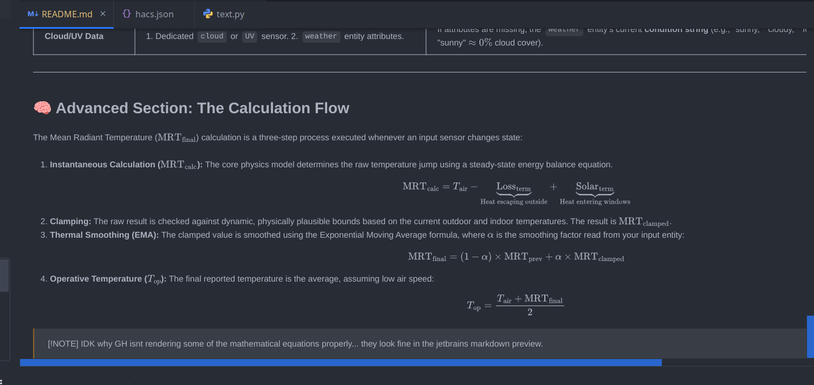

# 🌡️ Virtual Thermal Comfort (MRT & Operative Temperature)

## 🖼 ️Example Config Flow
View an example config flow with screenshots in the [docs/setup.md](./docs/setup.md) file.

---

## 🙏Thanks
I ported this logic from a blueprint that [@Ecronika](https://github.com/Ecronika) [shared in the Home Assistant Community Forums](https://community.home-assistant.io/t/blueprint-virtual-mrt-v0-1-10-mean-radiant-temperature-operative-temperature/945267/3)

---

## 📝 Note
There is already a custom integration named ['Thermal Comfort' ](https://github.com/dolezsa/thermal_comfort) that uses air temp and relative humidity to expose some perception sensors alongside dew point, frost point and heat index/humidex.
This integration is different in that it focuses on **Mean Radiant Temperature (MRT)** and **Operative Temperature ($T_{op}$)**, which are more advanced concepts from building science that better represent how humans perceive temperature in a space.

---

## 🏡 Introduction: What This Integration Does

This integration brings a professional building science concept—**Thermal Comfort**—into Home Assistant. Instead of just showing the air temperature, this tool creates a **Virtual Room Device** that calculates how hot or cold a person *actually feels*.

* **Standard Thermometer:** Measures Air Temperature ($T_{air}$).
* **Virtual Sensor:** Measures **Operative Temperature** ($T_{op}$), which is the most accurate single metric for human comfort, accounting for both air temperature and the radiant heat from surrounding surfaces.

This is achieved by computing the **Mean Radiant Temperature (MRT)**, which tracks the temperature of the walls, windows, and ceiling based on outside weather and sun exposure.

---

## 💡 Why MRT and $T_{op}$ Are Useful

| Sensor                        | Definition                                                                         | Use in HASS                                                                                                                                                                                               |
|:------------------------------|:-----------------------------------------------------------------------------------|:----------------------------------------------------------------------------------------------------------------------------------------------------------------------------------------------------------|
| **Mean Radiant Temp (MRT)**   | The effective temperature of the room's surfaces (walls, windows, floor, ceiling). | Essential for **monitoring radiant systems** (floor heating/cooling). It allows you to see the thermal lag of your home's structure.                                                                      |
| **Operative Temp ($T_{op}$)** | The average of the Air Temperature and the MRT ($\frac{T_{air} + \text{MRT}}{2}$). | **The ultimate trigger for HVAC automation.** Use $T_{op}$ instead of $T_{air}$ to ensure your heating/cooling system only runs when a person *feels* uncomfortable, saving energy and improving comfort. |

---

## 🏠 Room Configuration: Profiles and Inputs

This integration exposes a **Virtual Device** for each room you configure. This device contains the calculated $T_{op}$ and MRT sensors, along with a set of configurable **Number Inputs** to fine-tune the model to your home's unique physical characteristics.

### 1. The Core Configurable Inputs (Profiles)

The calculation relies on **four primary configurable inputs** (number entities) that represent the structural qualities of your room.

| Input Name                                     | Layman's Explanation                                                                                                                                      | Value Range   | Example by Home Type                                                                      |
|:-----------------------------------------------|:----------------------------------------------------------------------------------------------------------------------------------------------------------|:--------------|:------------------------------------------------------------------------------------------|
| **Exterior Envelope Ratio** ($f_{\text{out}}$) | **Exterior Wall Share.** How much of the room's total interior surface area touches the outside or an unconditioned space (like an attic or cold garage). | $0.0 - 1.0+$  | **0.15:** Interior apartment room. **0.80:** Corner room. **0.95:** Top-floor attic room. |
| **Window Share** ($f_{\text{win}}$)            | **Window Ratio.** The percentage of the exterior wall area that is glass.                                                                                 | $0.0 - 1.0$   | **0.10:** Small basement window. **0.50:** Large picture window/patio door.               |
| **Insulation Loss Factor** ($k_{\text{loss}}$) | **Heat Leakage / U-Value.** How poorly insulated your walls and windows are, influencing heat loss in winter. (Higher value = worse insulation).          | $0.05 - 0.30$ | **0.10:** Modern, well-insulated home. **0.25:** Old, uninsulated walls.                  |
| **Solar Gain Factor** ($k_{\text{solar}}$)     | **Solar Heating Power.** How much solar energy actually passes through your windows to heat the room (often called SHGC).                                 | $0.0 - 2.0$   | **0.8:** Standard clear glass. **1.5:** Tilted skylight/very large clear windows.         |

### 2. Thermal Smoothing Factor ($\alpha$)

This input is critical for accurately modeling the room's **thermal inertia** (thermal mass).

| Input Name                              | Purpose                                                                                            | Suggested Range                      |                                                                                                                                                                                                                                                                                                                                                                                                          |
|:----------------------------------------|:---------------------------------------------------------------------------------------------------|:-------------------------------------|:---------------------------------------------------------------------------------------------------------------------------------------------------------------------------------------------------------------------------------------------------------------------------------------------------------------------------------------------------------------------------------------------------------|
| **Thermal Smoothing Factor** ($\alpha$) | Controls **how quickly** the calculated MRT responds to changes in outside conditions (sun, wind). | $0.05$ (Slowest) to $0.95$ (Fastest) | A North American 1950's wood-frame house has **low thermal mass**. You would use a **higher $\alpha$** (e.g., $0.40$ – $0.60$) because the room temperature reacts relatively quickly to external changes. A German home with thick masonry walls would use a **lower $\alpha$** (e.g., $0.05$ – $0.20$) because the thick stone/concrete acts as a huge heat buffer, smoothing changes over many hours. |

#### Update Behavior
* When you **edit the $\alpha$ factor**, the change is **immediate** for the next calculation cycle.
* However, the effect of the change on the sensor reading ($\text{MRT}_{\text{final}}$) will be **gradual** because the smoothing formula is designed to integrate the new value slowly with the existing history. You will not see the MRT instantly jump.

### 3. Profile Management

The integration allows you to save a library of custom profiles per room.

* **Profile Selector:** The `select.profile` entity lists all default profiles and any custom profiles you save.
* **Save/Delete:** Use the `text.profile_name` input and the `button.save_profile` / `button.delete_profile` entities to manage your library.
* **"Custom Profile" State:** If you select a default profile and manually change any of the four number inputs, the `select.profile` entity will automatically switch its state to **"Unsaved Custom Profile"** (this is your working scratchpad).
    * If you then select a default profile and re-select "Unsaved Custom Profile" again, it loads the values you last saved to that scratchpad.
      * You can then input a profile name and save it as a new custom profile.
    * There is a cap of **100 custom profiles** per device (aka room).

---

## 📡 External Data Sources and Fallbacks

The MRT calculation is reactive, meaning it constantly adjusts based on real-time weather conditions. For this, it pulls data from the **Weather Entity** and the optional **Global Solar Radiation Sensor**.

### 1. External Inputs

The integration uses the following fields from your selected entities:

| Data Point                       | Source                                                       | Use in Calculation                                                                                                                                                         |
|:---------------------------------|:-------------------------------------------------------------|:---------------------------------------------------------------------------------------------------------------------------------------------------------------------------|
| **Outdoor Air Temp ($T_{out}$)** | `weather` entity attribute (`temperature`)                   | Calculates the **Heat Loss Term** (how much heat escapes through the walls).                                                                                               |
| **Apparent Temperature**         | `weather` entity attribute (`apparent_temperature`)          | Used to determine effective heat loss. If Apparent Temp is **lower** than $T_{out}$ (due to **wind chill**), the lower value is used for a more accurate loss calculation. |
| **Wind Speed / Wind Gust**       | `weather` entity attribute (`wind_speed`, `wind_gust_speed`) | Calculates the **Wind Effect Factor** (convective loss). Higher wind speed increases the heat loss from the exterior envelope.                                             |
| **Cloud Coverage / UV Index**    | `weather` entity attributes or dedicated `sensor`            | Used to estimate **Global Solar Radiation** (Solar Gain).                                                                                                                  |
| **Precipitation / Condition**    | `weather` entity state (`rainy`, `snowy`, etc.)              | Used to apply a **Rain Multiplier** (penalty) to the solar gain, simulating dark, wet conditions that reduce radiation transmission.                                       |
| **Sun Elevation**                | Home Assistant's `sun.sun` entity                            | Determines the **Daylight Factor**, used as a multiplier for solar gain when the sun is below the horizon.                                                                 |
| **Global Solar Radiation**       | Optional dedicated `sensor` (e.g., `sensor.solar_radiation`) | **Preferred source** for solar gain calculation. Bypasses all weather heuristics if available (will log a warning on values > `1300 W/m²`, but will still use it).         |

>[!NOTE]
> For best results, use a **physical Total Solar Radiation Sensor** (W/m²). These
> sensors provide the most accurate measurement of solar radiation impacting your home.
> If no sensor is supplied, the integration will intelligently estimate irradiance 
> using weather data, but cap it at `1000 W/m²`.

#### Virtual Global Solar Radiation Sensor
I don't have a physical one, so instead, I created a virtual sensor using the HASS built-in 
[Forcast.Solar](https://www.home-assistant.io/integrations/forecast_solar) integration. **YOU MUST** use `1000` as your 
`total watt peak power` and `0` as your `declination angle` to get correct W/m² output for Global Horizontal 
Irradiation (GHI), I left the default `azimuth` of `180`.

I take the output sensor `Estimated power production - now` convert it's value directly to W/m² by using a 
HASS helper template sensor and setting its `device_class` to `irradiation` and `unit_of_measurement` to `W/m²`.
If the sensor outputs `123 W`, it is converted to `123 W/m²` and the template sensor is used as the dedicated Global Solar
Radiation Sensor in this integration.

### 2. Built-in Fallback Logic

The integration is designed to be highly resilient. Data is checked in a specific priority order, and if critical 
external sensors are missing or unavailable, the system uses logical heuristics to ensure the calculation continues 
without interruption.

| Data Point                  | Priority Order                                                                                  | Fallback Action                                                                                                                                                                                                       |
|:----------------------------|:------------------------------------------------------------------------------------------------|:----------------------------------------------------------------------------------------------------------------------------------------------------------------------------------------------------------------------|
| **Outdoor Temperature**     | 1. Dedicated `temperature` sensor (if provided). 2. `weather` entity attribute (`temperature`). | If all sensors are missing, a default value (e.g., 10°C) is used as a final last resort.                                                                                                                              |
| **Solar Irradiance** (W/m²) | 1. Dedicated **Global Solar Radiation Sensor**.                                                 | If a dedicated sensor is missing or unavailable, a **heuristic model** is used: $$\text{Irradiance} \approx \text{UV} \times \text{Cloud Cover Penalty} \times \text{Rain Multiplier} \times \text{Daylight Factor}$$ |
| **Cloud/UV Data**           | 1. Dedicated `cloud` or `UV` sensor. 2. `weather` entity attributes.                            | If attributes are missing, the `weather` entity's current **condition string** (e.g., "sunny," "cloudy," "fog") is used to guess the coverage (e.g., "sunny" $\approx 0\%$ cloud cover).                              |

---

## 🧠 Advanced Section: The Calculation Flow

The Mean Radiant Temperature ($\text{MRT}_{\text{final}}$) calculation is a three-step process executed whenever an input sensor changes state:

1.  **Instantaneous Calculation ($\text{MRT}_{\text{calc}}$):** The core physics model determines the raw temperature jump using a steady-state energy balance equation.\
    $$\text{MRT}_{\text{calc}} = T_{\text{air}} - \underbrace{\text{Loss}_{\text{term}}}_{\text{Heat escaping outside}} + \underbrace{\text{Solar}_{\text{term}}}_{\text{Heat entering windows}}$$

2.  **Clamping:** The raw result is checked against dynamic, physically plausible bounds based on the current outdoor and indoor temperatures. The result is $\text{MRT}_{\text{clamped}}$.

3.  **Thermal Smoothing (EMA):** The clamped value is smoothed using the Exponential Moving Average formula, where $\alpha$ is the smoothing factor read from your input entity:\
    $$\text{MRT}_{\text{final}} = (1 - \alpha) \times \text{MRT}_{\text{prev}} + \alpha \times \text{MRT}_{\text{clamped}}$$

4.  **Operative Temperature ($T_{op}$):** The final reported temperature is the average, assuming low air speed:
    $$T_{\text{op}} = \frac{T_{\text{air}} + \text{MRT}_{\text{final}}}{2}$$

>[!NOTE]
> IDK why GH isnt rendering some of the mathematical equations properly... they look fine in the jetbrains markdown preview.

